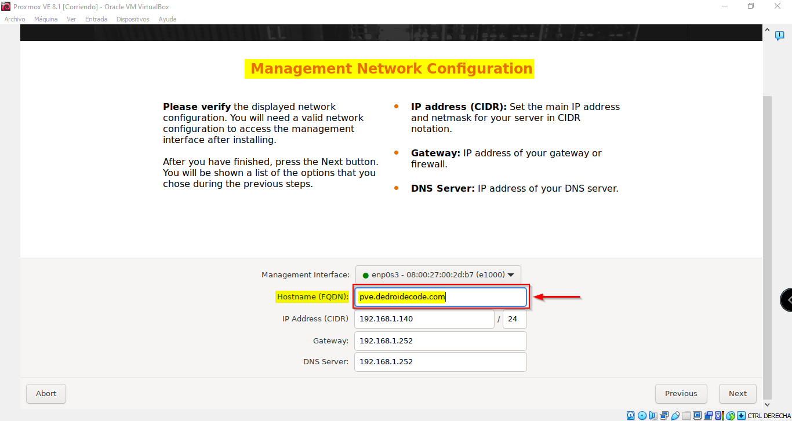

# Proxmox Virtual Environment

------------

> Proxmox VE es una plataforma de virtualización de código abierto que permite gestionar máquinas virtuales y contenedores de forma centralizada. Ofrece características avanzadas para la creación, gestión y monitorización de entornos de virtualización, incluyendo clusters de servidores y almacenamiento compartido.

La **Guía de Virtual Machines 001 DendroIDE Code** se dedica a la explicación de la instalación y configuración de la plataforma: **Proxmox Virtual Environment 8.1**, utilizando una máquina virtualizada con **Oracle VM VirtualBox** el cual es un software de virtualización para arquitecturas x86/amd64.

## Requisitos mínimos del sistema recomendado por DendroIDE Code.

### Requisitos de Hardware
- **Procesador:**
	* Procesador de novena generación o superior Intel o AMD con 64 bits en la unidad central de proceso.
	* Procesador con mínimo cuatro unidades centrales y núcleos de procesamiento que pueden ejecutar hasta cuatro procesos de manera simultánea o superior.
	* Procesador con mínimo cuatro unidades centrales y núcleos de procesamiento que pueden ejecutar hasta cuatro procesos de manera simultánea o superior.
	* Procesador compatible con la virtualización por hardware (Intel VT-x/AMD-V) para usar KVM.

- **Memoria (RAM):**
	* 8 GB de memoria RAM o superior.

- **Almacenamiento:**
	* Disco duro mecánico o SSD con al menos 128 GB de espacio libre para la instalación del sistema operativo y almacenamiento de datos.
	* Se recomienda un almacenamiento adicional con almenos 256 GB de espacio libre para almacenar imagenes isos, máquinas virtuales, respaldos, templates y datos de contenedores.

- **Red:**
	* Se requiere una o más tarjetas de red Ethernet compatibles con la infraestructura del servidor a implementar
	* Se recomienda una conexión de red estable y de alta velocidad para un rendimiento óptimo..

### Requisitos de Software
- **Sistema Operativo:** 
	* Proxmox VE 8.1 es un sistema operativo basado en Debian, por lo que no se requiere un sistema operativo previamente instalado.

- **Hypervisor:** 
	* Proxmox VE utiliza KVM (Kernel-based Virtual Machine) como hipervisor para la virtualización de máquinas.

- **Navegador Web:** 
	* Se recomienda tener un navegador web moderno y compatible (como Google Chrome, Mozilla Firefox, o Microsoft Edge) para acceder a la interfaz de administración basada en web.

#### Antes de comenzar
------------
> - Recuerda que la instalación de Proxmox se realizará en un entorno virtualizado utilizando Oracle VM Virtual Box 7.0.
> - Es importante verificar la compatibilidad del hardware, especialmente en lo que respecta a los controladores de red y almacenamiento, para garantizar un funcionamiento correcto.
> - Se recomienda revisar la documentación oficial de Proxmox VE para obtener información detallada sobre los requisitos del sistema y la compatibilidad del hardware.

### Proceso de instalación de Proxmox Virtual Environment utilizando Oracle VM VirtualBox 7.0

* #### **Paso 01.**
  Navegar al sitio web oficial de [Proxmox Virtual Environment](https://www.proxmox.com/en/) para proceder a la descarga del software.
  
  

* #### **Paso 02.**
  Descargar la imagen ISO que contiene el instalador con la versión de [Proxmox VE 8.1](https://enterprise.proxmox.com/iso/proxmox-ve_8.1-2.iso).
  
  

* #### **Paso 03.**
  Al finalizar la descarga del instalador de Proxmox VE 8.1 contenido en la imagen ISO, procederemos a la creación de la máquina virtual que ejecutará el entorno  de virtualización de servidores de código abierto. Para ello, es necesario abrir el software de Oracle VM VirtualBox 7.0.

  

* #### **Paso 04.**
  En el menú principal del software Oracle VM VirtualBox 7.0, seleccionar el submenú **Máquina**, y luego la opción **Nueva**. También funcionaría con el comando **Ctrl + N** en Windows OS, o utilizando la opción secundaria presentada en la pantalla principal definida como **Nueva**.
  
  

* #### **Paso 05.**
  Asignar el nombre a la máquina virtual, para caso de la guía el nombre será: Proxmox VE 8.1.
  
  

* #### **Paso 06.**
  Se debe establecer la ubicación de la máquina virtual, ésta puede estar alojada en la ruta predeterminada por el software de Oracle VM VirtualBox 7.0 o puede ser almacenada en una ubicación predefinida por el usuario, las únicas recomendaciomnes son que primero el almacenamiento sea fijo y que dicho almacenamiento tenga espacio suficiente parael correcto funcionamiento del sistema.

  

  

* #### **Paso 07.**
  Navegar hasta la ubicación de la imagen ISO de Proxmox VE 8.1 descargada y seleccionarla.

  

  
  
* #### **Paso 08.**
  Proxmox Virtual Environment (VE) está basado en Debian GNU/Linux. Debian es una distribución de Linux estable y popular que ha servido como base para numerosos proyectos y derivados. Proxmox VE toma la robustez y estabilidad de Debian y la combina con herramientas de virtualización y administración, como KVM (Kernel-based Virtual Machine) y OpenVZ, para ofrecer una plataforma de virtualización completa y poderosa. Por lo tanto, seleccionamos el tipo y versión del sistema operativo.
  
  
  
  
  
* #### **Paso 09.**
  Una vez se encuentre asignada la configuración del nombre y sistema operativo de la máquina virtual a utilizar, seleccionar la opción **siguiente**.

  
  
* #### **Paso 10.**
  Definido como requisito mínimo de hardware, se establece un valor inicial de 8 GB por parte de la memoria ram. En la guía, como parte de estúdio serán definidas 16 GB de memoria ram.

  
  
* #### **Paso 11.**
  Definido como requisito mínimo de hardware, se establece un valor inicial de cuatro unidades centrales de procesamiento. En la guía, como parte de estúdio serán definidas 6 Unidades de CPUs.

  
  
* #### **Paso 12.**  
  Una vez se encuentre asignada la configuración del hardware de la máquina virtual a utilizar, seleccionar la opción **siguiente**.
  
  
  
* #### **Paso 13.**  
  Definido como requisito mínimo de hardware, se establece un valor inicial con al menos 128 GB de espacio libre en un disco duro mecánico o SSD para la instalación del sistema operativo y almacenamiento de datos. Pero, al ser un sistema virtualizado las circunstancias **cambian**. Utilizando Oracle VM VirtualBox 7.0, se establecerá como parte de estudio un disco duro virtual dinámico con 128.00 GB de almacenamiento.

    > En Oracle VM VirtualBox 7.0, un disco virtual es un archivo que representa el disco duro de una máquina virtual. Funciona de manera similar a un disco físico en una computadora real, pero está encapsulado dentro de un archivo en el sistema de archivos del host. Este archivo contiene toda la información y datos almacenados dentro de la máquina virtual, incluidos el sistema operativo, las aplicaciones y los archivos del usuario.
    
    > Los discos virtuales en VirtualBox también pueden ser dinámicos o fijos. Los discos dinámicos crecen según sea necesario para almacenar datos, mientras que los discos fijos reservan todo el espacio definido desde el principio, lo que puede ocupar más espacio en el disco físico pero puede ofrecer un mejor rendimiento.

    > *En **resumen**, un disco virtual en Oracle VM VirtualBox 7.0 es un archivo que simula un disco duro físico y contiene todos los datos de una máquina virtual, permitiendo que la máquina virtual funcione como si estuviera utilizando un hardware físico real.*
    
  
  
* #### **Paso 14.**
  Una vez se encuentre asignada la configuración del disco duro virtual de la máquina virtual a utilizar, seleccionar la opción **siguiente**.
  
  
  
* #### **Paso 15.**
  Se visualiza un resumen de la máquina virtual en creación. En caso de estar conforme con la configuración realizada y presentada, deberá ser seleccionada la opción **terminar**. Caso contrario, la opción **anterior** permitirá gestionar el cambio de cualquier configuración previa. La opción **cancelar** permite cerrar la pantalla de creación de máquina virtuales y no proceder a realizar cualquier creación o modificación en el sistema.

  
  
* #### **Paso 16.**
  En el software de Oracle VM VirtualBox 7.0, se visualiza la máquina virtual creada. A continuación, se procede con la configuración avanzada de la máquina virtual que alojará el sistema de Proxmox VE 8.1.

  

* #### **Paso 17.**
  Seleccionar la máquina virtual creada con el nombre **Proxmox VE 8.1** o *con el nombre que haya sido asignado*, y luego seleccionar la opción de **configuración**, en donde se visualiza la pantalla de configuración con todos los detalles de la máquina virtual creada.

  

  

* #### **Paso 18.**
  Se deberá configurar la **red** de la máquina virtual, para ello hay que seleccionar la opción **Red** en la configuración de la máquina virtual.

  

  

* #### **Paso 19.**
  Es recomendable que se configure en tipo adaptador puente, debido a que en VirtualBox esa configuración de red permite que la máquina virtual se comunique directamente con la red física a la que está conectado el host. Esto significa que la máquina virtual obtiene una dirección IP directamente de la red física y puede interactuar con otros dispositivos en esa red como si fuera una máquina física. Para lo cual hay que seleccionar del menú de opciones en **Conectado a:** y escoger la opción de **Adaptador puente**.

  

* #### **Paso 20.**
  Al seleccionar la opción de **adaptador puente**, automáticamente se seleccionará el nombre de la tarjeta de red que se encuentre disponible.

  

* #### **Paso 21.**
  Una vez se encuentre asignada la configuración de red de la máquina virtual a utilizar, seleccionar la opción **aceptar** y el cuadro de diálogo se cerrará automáticamente.

  

* #### **Paso 22.**
  Se presenta la pantalla incial del software Oracle VM VirtualBox 7.0, por lo tanto la configuración de la máquina virtual a finalizado. Para continuar con la instalación del sistema operativo hay que **marcar** e iniciar la máquina virtual establecida seleccionando la opción **iniciar**.

  

  De igual manera, la máquina virtual puede ser iniciada al ser **marcada** y luego seleccionar en la barra de herramientas del software Oracle VM VirtualBox 7.0 la opción **máquina** y escoger en la cinta de opciones **inicar** y finalmente seleccionar **inicio normal**.

  

* #### **Paso 23.**
  Aparece la pantalla de bienvenida a Proxmox Virtual Environment 8.1 y comenzará el consumo de recursos configurados de la máquina fisica nativa.

  

* #### **Paso 24.**
  Es conveniente ocultar las notificaciones en el momento de la instalación y uso de Proxmox VE 8.1.
  
  

* #### **Paso 25.**
  Si al pulsar con un clic en la pantalla de bienvenida a Proxmox Virtual Environment 8.1, y aparece un cuadro de diálogo detallando la información de Oracle VM VirtualBox 7.0 describiendo el uso del mouse, es recomendable marcar la opción **no mostrar este mensaje de nuevo**, y posteriormente seleccionar la opción **capturar**.

  

  

* #### **Paso 26.**
  La captura de mouse en Oracle VM VirtualBox 7.0, es una característica que te permite "atrapar" o "capturar" el control del mouse dentro de la ventana de la máquina virtual. Cuando se activa la captura del mouse, el cursor del mouse se "encarcela" dentro de la ventana de la máquina virtual, lo que significa que no puede salir de esa ventana a menos que desactives la función de captura.

  > Para activar la captura de mouse en VirtualBox, generalmente solo necesitas hacer clic dentro de la ventana de la máquina virtual. Además, puedes presionar la tecla derecha Ctrl en tu teclado para activar o desactivar la captura de mouse manualmente.

  

  

